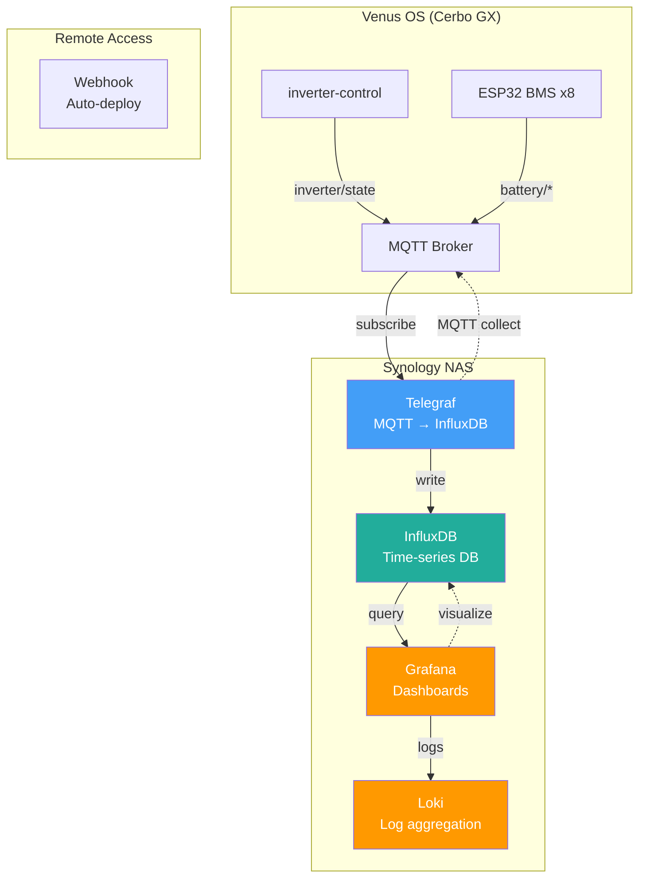
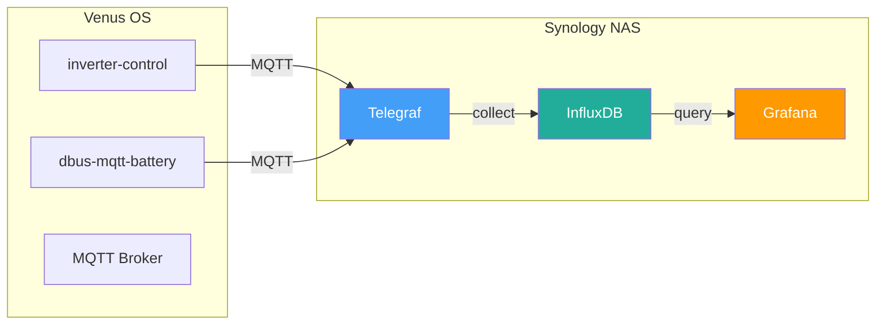
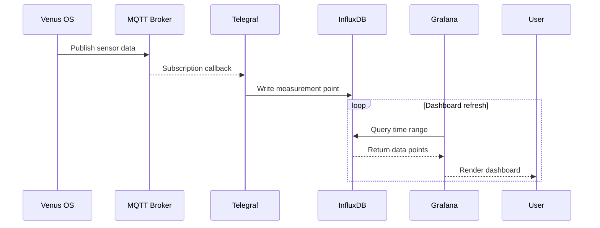
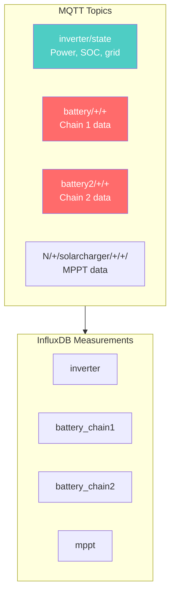

# System Architecture

## Data Flow Diagram

## Service Dependencies

## Data Collection Flow

## MQTT Topics Mapping

## Runbook: Troubleshooting

### No Data Appearing in Grafana

**Symptoms:**
- Dashboard shows "No data"
- InfluxDB queries return empty

**Actions:**
\`\`\`bash
# Verify Telegraf is running
docker ps | grep telegraf

# Check Telegraf logs
docker logs telegraf -f

# Test MQTT subscription
docker exec telegraf mosquitto_sub -v -t "#"

# Verify InfluxDB connectivity
docker exec telegraf nc -zv influxdb 8086
\`\`\`

### High Memory Usage from Telegraf

**Symptoms:**
- NAS memory nearly full
- Telegraf container using excessive RAM

**Actions:**
\`\`\`bash
# Reduce Telegraf buffer size in telegraf.conf
[agent]
  metric_buffer_limit = 1000

# Or restrict collected topics
[[inputs.mqtt_consumer]]
  topics = ["inverter/state", "battery/+/+/state"]
\`\`\`

### Grafana Dashboard Not Loading

**Symptoms:**
- Blank panels
- Timeout errors

**Actions:**
\`\`\`bash
# Check Grafana container
docker ps | grep grafana
docker logs grafana --tail 50

# Verify data source
curl -s http://localhost:3000/api/datasources

# Restart container
docker restart grafana
\`\`\`

---

## Related Documentation

- [inverter-control System Architecture](../inverter-control/.github/docs/system-architecture.md)
- [ADR-001: Grid-Zero Architecture](../inverter-control/.github/docs/adr-001-grid-zero-architecture.md)
