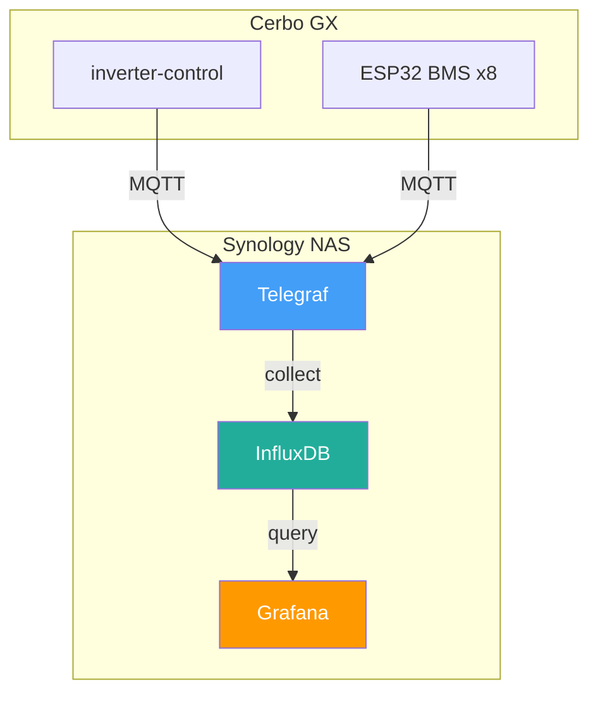
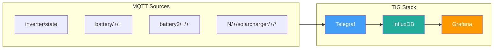

# Inverter Monitoring Stack

[](https://github.com/victron-venus/inverter-monitoring/actions/workflows/ci.yml)
[](https://opensource.org/licenses/MIT)
[](https://github.com/victron-venus/inverter-monitoring/stargazers)
[](https://github.com/victron-venus/inverter-monitoring/network/members)
[](https://github.com/victron-venus/inverter-monitoring/commits/main)
[](https://github.com/victron-venus/inverter-monitoring/graphs/commit-activity)

Telegraf + InfluxDB + Grafana monitoring for Victron inverter system.

## Architecture



## Quick Start

### 1. Configure Environment

```bash
cp .env.example .env
nano .env  # Set your INFLUX_TOKEN (generate with: openssl rand -hex 32)
```

### 2. Start Full Stack

```bash
docker-compose up -d
```

This starts:
- **InfluxDB** on http://localhost:8086
- **Grafana** on http://localhost:3000 (admin/admin)
- **Telegraf** collecting MQTT → InfluxDB
- **Loki** for logs on http://localhost:3100

### 3. Access Dashboards

Open http://localhost:3000 - dashboards are auto-provisioned!

### Alternative: Use Existing InfluxDB/Grafana

If you already have InfluxDB/Grafana running, just start Telegraf:

```bash
# Edit .env to point to your existing instances
INFLUX_URL=http://your-influxdb-host:8086

# Start only Telegraf
docker-compose up -d telegraf
```

## Data Flow

## Data Flow



### MQTT Topics Collected

| Topic | Description |
|-------|-------------|
| `inverter/state` | Main inverter state (power, SOC, voltages) |
| `battery/+/+` | Battery chain 1 (ESP32 BMS data) |
| `battery2/+/+` | Battery chain 2 (ESP32 BMS data) |
| `N/+/solarcharger/+/*` | MPPT charger data from Cerbo |

### InfluxDB Measurements

| Measurement | Tags | Fields |
|-------------|------|--------|
| `inverter` | host | setpoint, grid_power, solar_total, battery_power, battery_soc, battery_voltage |
| `battery_chain1` | battery, field | voltage, current, soc, temp |
| `battery_chain2` | battery, field | voltage, current, soc, temp |
| `mppt` | portal_id, instance | power, voltage, current |

## Embedding in Go Dashboard

Grafana panels can be embedded via iframe:

```html
<iframe
  src="http://your-grafana-host:3000/d-solo/inverter-overview/inverter?orgId=1&panelId=1&theme=dark"
  width="100%"
  height="400"
  frameborder="0">
</iframe>
```

For public access without login, enable anonymous auth in Grafana:

```ini
# /etc/grafana/grafana.ini
[auth.anonymous]
enabled = true
org_name = home
org_role = Viewer
```

## Auto-Deploy via GitHub Webhook (Optional)

If you have Cloudflare Argo tunnel to your Synology, you can enable auto-deploy:

### 1. Generate webhook secret
```bash
openssl rand -hex 32
# Add to .env as WEBHOOK_SECRET
```

### 2. Start webhook service
```bash
docker-compose --profile webhook up -d
```

### 3. Configure Argo tunnel
Add route in Cloudflare dashboard:
- Public hostname: `deploy.yourdomain.com`
- Service: `http://localhost:9000`

### 4. Configure GitHub webhook
1. Go to repo Settings → Webhooks → Add webhook
2. Payload URL: `https://deploy.yourdomain.com/webhook`
3. Content type: `application/json`
4. Secret: your WEBHOOK_SECRET
5. Events: Just the push event

Now pushes to main branch will auto-deploy!

## Documentation

- [System Architecture](./.github/docs/system-architecture.md) - Data flow diagrams, runbook

## Files

```
inverter-monitoring/
├── docker-compose.yml      # Telegraf + Loki + Webhook stack
├── telegraf.conf           # MQTT → InfluxDB config
├── .env.example            # Environment variables template
├── .env                    # Your secrets (gitignored)
├── promtail.yml            # Log shipping config (optional)
├── webhook/                # GitHub webhook auto-deploy
│   ├── server.py           # Flask webhook listener
│   ├── Dockerfile          # Container build
│   └── deploy-local.sh     # Deploy script
└── grafana/
    └── dashboards/
        └── inverter-overview.json   # Main dashboard
```
## Related Projects

This project is part of the Victron Venus OS integration suite:

| Project | Description |
|---------|-------------|
| [inverter-control](https://github.com/victron-venus/inverter-control) | Advanced ESS external control system with grid-zero targeting |
| [inverter-dashboard](https://github.com/victron-venus/inverter-dashboard) | Real-time web dashboard (Python/FastAPI) via MQTT |
| [inverter-dashboard-go](https://github.com/victron-venus/inverter-dashboard-go) | High-performance Go rewrite of the web dashboard |
| [inverter-desktop](https://github.com/victron-venus/inverter-desktop) | Native desktop application (Rust/Tauri) for system monitoring |
| [dbus-mqtt-battery](https://github.com/victron-venus/dbus-mqtt-battery) | MQTT to D-Bus bridge for JBD BMS battery integration |
| [dbus-tasmota-pv](https://github.com/victron-venus/dbus-tasmota-pv) | Tasmota smart plug integration as a PV inverter on D-Bus |
| [esphome-jbd-bms-mqtt](https://github.com/victron-venus/esphome-jbd-bms-mqtt) | ESP32 Bluetooth monitor for JBD BMS batteries |
| **inverter-monitoring** (this) | TIG (Telegraf, InfluxDB, Grafana) monitoring stack |
| [terraform-github-victron](https://github.com/4alvit/terraform-github-victron) | Infrastructure as Code for the GitHub organization |


## License

MIT License

## Contributing

1. Fork the repository
2. Create a feature branch (`git checkout -b feature-name`)
3. Commit your changes
4. Push to the branch (`git push origin feature-name`)
5. Create a Pull Request

## Support

For issues specific to:
- **Telegraf configuration**: See [Telegraf documentation](https://docs.influxdata.com/telegraf/)
- **InfluxDB**: See [InfluxDB documentation](https://docs.influxdata.com/influxdb/)
- **Grafana**: See [Grafana documentation](https://grafana.com/docs/)
- **This integration**: Open an issue in this repository

**Note:** This is a community project and is not affiliated with Victron Energy.
